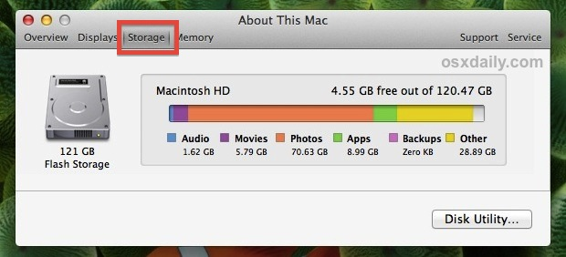

# CSI 387 Preliminary Design Document

## 1.1 Proposal: 
Our group proposes the addition of Storage Breakdown GUI. From the command line, the command "dsb" (disk storage breakdown).

## 1.2 Reasons why this is a good addition: 

The Macintosh OS has the capability to display a breakdown of total diskspace in contrast with the diskspace that the system, folders, subfolders, and files utilize. It is our belief that Linux would benefit from the addition of a similar breakdown. Our vision is to implement this breakdown into Linux using a base-level script in the terminal. This command, once implemented, will quickly show a graphical terminal interface depicting a breakdown of total storage space being used, as well as the types of files that occupy that space.

## 1.3 Preliminary List of Linux Modules that will be modified/affected: 
Linux Modules that will be potentially modified/affected include, but are not limited to, the following: 
Module | Description
-------|------------
/lib   | contains kernel modules and shared library images required to boot the system and run commands in root file system.
/proc  | A virtual and pseudo file-system which contains information about running process with a particular Process-id aka pid.
/root  | home directory of root user
/sys   | stores and allows modification of the devices connected to the system.
/etc/exports | Information of the file system available on network.
/etc/fstab | Information of Disk Drive and their mount point.

 
As well as any potential modules which include information regarding directories and subdirectories.

## 1.4 Preliminary list of any new modules that you will produce:

At the moment, we do not believe that <b>many</b> additional modules need to be created in order to achieve our addition. Listed here are a couple of general ideas for addition modules needed.

Module   | Description
---------|------------
/searcha | search system files and organize by file types
/grph    | to show a graphical representation of interpreted data